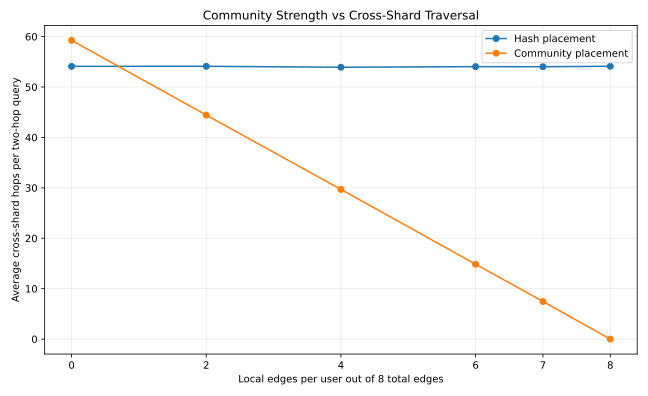
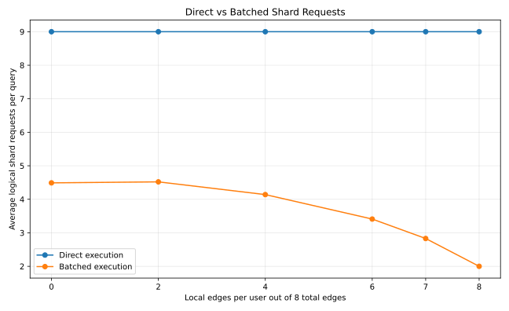
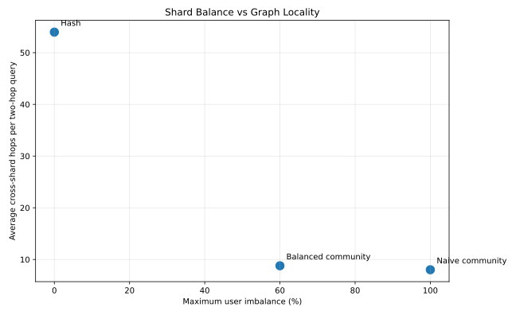
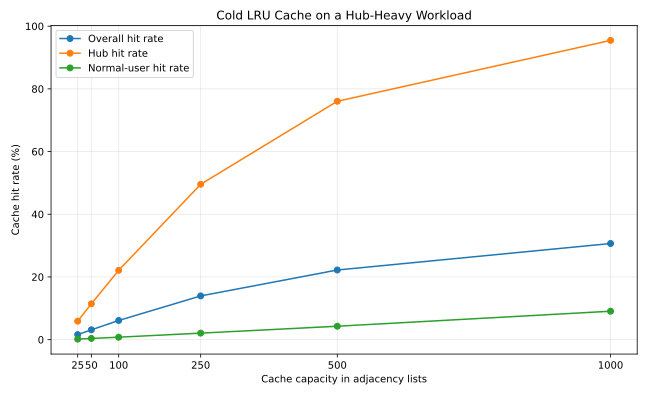
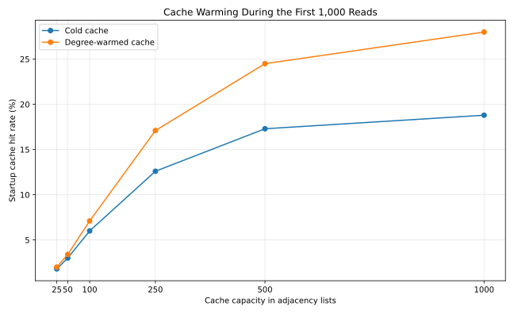
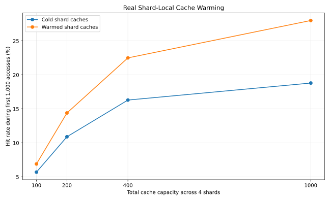

# GraphShard Lab

GraphShard Lab is a Rust research prototype for studying how graph data placement and query execution affect shard balance and cross-shard work.

It focuses on one main question:

> How should connected graph data be placed and queried across shards?

The project compares:

- Hash-based placement
- Community-based placement
- Balanced community placement
- Direct two-hop query execution
- Batched two-hop query execution
- Hub-heavy workload generation and hotspot analysis
- Bounded LRU cache simulation
- Degree-based cache warming experiments

All shards are logical, in-memory shards running inside one Rust process.

---

## Key findings

### Community-aware placement improves locality

Synthetic workload: 10,000 users, 8 outgoing edges per user (7 of 8 staying inside the user's community), 4 logical shards.

| Placement | Average cross-shard hops |
|---|---:|
| Hash | 54.02 |
| Community | 7.46 |

**Community placement produced 86.19% fewer logical cross-shard hops than hash placement** in this workload.



### Batching reduces logical shard requests

The project compares two ways of executing the same two-hop query.

**Direct execution** — each first-hop user is read separately:

```text
Read user A
Read user B
Read user C
```

**Batched execution** — first-hop users are grouped by shard:

```text
Shard 1: read users A and B together
Shard 2: read user C
```

Direct execution used **9.00** logical shard requests per query. In the original locality sweep, batched execution used between **2.00** and **4.52** requests — a reduction of **49.74% to 77.78%**.

Both execution methods returned exactly the same query results.



### Batching across multiple seeds and shard counts

To make the batching result more trustworthy, GraphShard Lab also runs a second sweep across:

- **5 random seeds:** 42, 43, 44, 45, 46
- **4 shard counts:** 2, 4, 8, 16
- **2 locality levels:** 4 local edges per user, 7 local edges per user

This produces 5 × 4 × 2 = **40 benchmark settings**.

Key results:

- Under **moderate locality** (4 local edges): batching reduced logical shard requests by **37.61% to 67.19%**.
- Under **strong locality** (7 local edges): batching reduced logical shard requests by **66.67% to 71.87%**.

This shows that:

- batching stays effective across different generated graphs;
- batching helps less as shard count increases, since connected users are more spread out;
- batching remains highly effective when community locality is strong.


> These are logical request counts inside an in-process prototype, not real network requests or measured latency.

### Uneven communities create a balance trade-off

Community sizes used for this workload: `[4000, 2500, 1500, 1000, 1000]`.

| Placement | Users per shard | Max imbalance | Avg hops | Batched request reduction |
|---|---|---:|---:|---:|
| Hash | [2500, 2500, 2500, 2500] | 0% | 53.97 | 48.84% |
| Naive community | [5000, 2500, 1500, 1000] | 100% | 8.02 | 67.91% |
| Balanced community | [4000, 2500, 1500, 2000] | 60% | 8.79 | 66.93% |

- **Hash placement** gives perfect balance but poor graph locality.
- **Naive community placement** gives strong locality but may overload a shard.
- **Balanced community placement** keeps most of the locality benefit while improving the distribution.

The remaining 60% imbalance cannot be removed without splitting the largest 4,000-user community.



### Hub-heavy hotspots and caching

Workload: 10,000 users, 100 hub users, 8 outgoing edges per user, 2 edges per user targeting hubs.

The hubs represent only **1% of all users** but receive **25% of all logical adjacency reads**.

| User type | Average adjacency reads |
|---|---:|
| Hub | 200.00 |
| Normal user | 6.06 |

An average hub adjacency list is read **33× more often** than an average normal-user adjacency list — a concentrated hot set well suited to caching.

**Cold bounded LRU cache** — the cache starts empty and stores user IDs representing cached adjacency lists. A cache hit means a repeated logical adjacency lookup could be served from the cache rather than the main graph structure.

| Capacity | Overall hit rate | Hub hit rate | Normal-user hit rate |
|---:|---:|---:|---:|
| 25 | 1.60% | 5.90% | 0.17% |
| 50 | 3.14% | 11.43% | 0.38% |
| 100 | 6.12% | 22.12% | 0.78% |
| 250 | 13.95% | 49.56% | 2.08% |
| 500 | 22.22% | 76.05% | 4.28% |
| 1,000 | 30.67% | 95.47% | 9.07% |

At capacity 1,000, the cache served **95.47%** of repeated hub accesses, compared with only **9.07%** of normal-user accesses — concentrated graph hotspots are far more cacheable than a large, weakly reused normal-user set.



---

## Distributed shard simulation

The project includes an asynchronous distributed-shard simulation built with Tokio.

Each logical shard runs in its own Tokio task and owns a separate local `Graph`. A coordinator routes users and queries to shard workers through bounded `mpsc` channels. Each request uses a `oneshot` channel for its response.

```text
Coordinator
    |
    | bounded command messages
    v
+----------+  +----------+  +----------+  +----------+
| Shard 0  |  | Shard 1  |  | Shard 2  |  | Shard 3  |
| worker   |  | worker   |  | worker   |  | worker   |
+----------+  +----------+  +----------+  +----------+
```

### Distributed query execution

Two implementations of the two-hop query are compared:

- **Direct** — sends one shard request for every first-hop user.
- **Batched** — groups first-hop users by owning shard and sends one batch message per shard. Batch requests to different shards are dispatched concurrently.

```text
Direct:
  source read → first-hop read → first-hop read → first-hop read → ...

Batched:
  source read → concurrent batch request to each required shard
```

**Simulated network delay** — shard read messages can be configured with a simulated delay. An individual read pays one delay; a batch containing multiple adjacency-list reads also pays only one delay. This models the latency advantage of reducing message round trips. It is a single-process simulation and does not represent real network transport, serialization, node failure, or separate machines.

**Latency benchmark**

Configuration: 4 shard workers, 100 query sources, 3 repetitions per source (300 samples per strategy), 2 ms simulated delay per shard read message.

| Strategy | p50 | p95 | p99 |
|---|---:|---:|---:|
| Direct | 17,175 µs | 30,037 µs | 31,215 µs |
| Batched | 6,884 µs | 7,494 µs | 8,075 µs |
| **Reduction** | **59.92%** | **75.05%** | **74.13%** |

The batched implementation reduced median latency by **59.92%** and p99 latency by **74.13%** in this simulated workload.

Raw results: `results/distributed_latency.csv`

### Degree-based cache warming

The warming experiment preloads the most-followed hubs before measured traffic begins.

Warming had little effect across the complete 80,000-access run, since a cold LRU cache gradually learns the popular users on its own. It did, however, improve startup behavior during the first 1,000 accesses:

| Capacity | Cold startup hit rate | Warmed startup hit rate | Improvement |
|---:|---:|---:|---:|
| 250 | 12.60% | 17.10% | +4.50 points |
| 500 | 17.30% | 24.50% | +7.20 points |
| 1,000 | 18.80% | 28.00% | +9.20 points |

Across the complete workload, warming improved the total hit rate by at most **0.13 percentage points**. The main benefit of warming here is avoiding cold-start misses, not improving steady-state behavior.



> These are simulated logical cache hits. The cache stores user IDs rather than actual adjacency-list data, and this experiment does not measure real latency.

### Real shard-local adjacency caches

The cache was then integrated into actual sharded two-hop query execution. Each of the four logical shards owns an independent LRU cache containing real adjacency lists (`user ID → IDs of users followed`).

On a cache miss, the query reads the adjacency list from the owning shard's graph and inserts it into that shard's cache. On a hit, the cached adjacency list is used directly. Every cached query result was checked against the uncached reference graph.

| Capacity per shard | Total capacity | Cache hits | Cache misses | Hit rate |
|---:|---:|---:|---:|---:|
| 25 | 100 | 4,935 | 75,065 | 6.17% |
| 50 | 200 | 9,300 | 70,700 | 11.62% |
| 100 | 400 | 15,561 | 64,439 | 19.45% |
| 250 | 1,000 | 24,560 | 55,440 | 30.70% |

With 1,000 total cached adjacency lists, **30.70%** of accesses were served from actual shard-local caches while returning identical query results.

Real cache warming produced the following startup result:

| Capacity per shard | Cold first 1,000 | Warm first 1,000 | Improvement |
|---:|---:|---:|---:|
| 25 | 5.70% | 6.90% | +1.20 points |
| 50 | 10.90% | 14.40% | +3.50 points |
| 100 | 16.30% | 22.50% | +6.20 points |
| 250 | 18.80% | 28.00% | +9.20 points |

Across the complete workload, warming improved the hit rate by only **0.12 percentage points** at the largest capacity, since the cold LRU cache learns the hot set during normal traffic.



> These measurements show cache reuse, not query-speed improvement. The shards and caches still run inside one process, and real latency is not measured.

The project retains an earlier ID-only cache simulator for comparison. Actual cached sharded queries use independent shard-local caches containing complete adjacency-list data.

---

## Graph model

Users are graph nodes. A directed `FOLLOWS` relationship is an edge:

```text
Alice → Bob
Bob → Charlie
```

A two-hop query starting from Alice follows `Alice → Bob → Charlie`, so the result is **Charlie**.

The project removes duplicate results and excludes the source user from its own result.

## Logical shards

A shard is a container holding part of the graph.

```text
ShardedGraph
├── Shard 0
├── Shard 1
├── Shard 2
└── Shard 3
```

Users are assigned to shards according to a placement strategy. Outgoing edges are stored with their source user, for example:

```text
Alice is stored on Shard 0
Bob is stored on Shard 2

Alice → Bob is stored with Alice on Shard 0
```

All shards exist inside one Rust process. No real network communication occurs.

## Placement strategies

**Hash placement**

```text
shard = user_id % shard_count
```

Spreads sequential user IDs evenly across shards. Provides good balance but ignores graph relationships, so connected users may be placed far apart.

**Naive community placement**

Users belonging to the same community are kept together. Communities are assigned to shards in repeating order:

```text
Community 0 → Shard 0
Community 1 → Shard 1
Community 2 → Shard 2
Community 3 → Shard 3
Community 4 → Shard 0
```

Improves locality but may create severe imbalance when community sizes differ.

**Balanced community placement**

Communities are processed from largest to smallest. Each community is assigned to the currently least-loaded shard:

```text
1. Sort communities by size
2. Find the least-loaded shard
3. Place the next community there
4. Repeat
```

Communities remain intact and are not split.

## Query execution strategies

**Direct execution**

Reads the outgoing edges of each first-hop user separately. If a source user follows eight users, the query performs:

```text
1 source read
8 first-hop reads
9 logical shard requests
```

**Batched execution**

Groups first-hop users by their shard. Instead of reading three users from the same shard separately:

```text
Read A from Shard 1
Read B from Shard 1
Read C from Shard 1
```

it treats them as one logical request:

```text
Read [A, B, C] from Shard 1
```

This changes how the work is organized but does not change the query result.

## Correctness

Every sharded query is checked against a normal, non-sharded reference graph:

1. Run the query on the reference graph.
2. Run direct execution on the sharded graph.
3. Run batched execution on the sharded graph.
4. Sort the result sets.
5. Confirm that all results match.

The benchmark stops if any strategy returns an incorrect answer. See the test suite for the current passing-test count.

## Metrics

GraphShard Lab records:

- Logical cross-shard hops
- Unique shards touched
- Direct logical shard requests
- Batched logical shard requests
- Request reduction percentage
- Users per shard
- Edges per shard
- Maximum user imbalance
- Maximum edge imbalance

**Cross-shard hop** — counted when a traversed edge connects users stored on different shards:

```text
Alice on Shard 0
Bob on Shard 2

Alice → Bob = one cross-shard hop
```

**Shard imbalance** — calculated relative to the average shard load:

```text
(maximum shard load - average shard load)
------------------------------------------ × 100
             average shard load
```

## Workloads

The project generates deterministic synthetic graph workloads. Parameters include: total users, number of communities, community sizes, edges per user, local edges per user, hub count, hub-targeting edges per user, random seed, and shard count. Using the same seed and parameters produces the same graph.

Current benchmark families:

1. **Locality sweep** — equal-sized communities with 0, 2, 4, 6, 7, or 8 local edges per user.
2. **Uneven-community workload** — community sizes `[4000, 2500, 1500, 1000, 1000]`.
3. **Multi-seed, multi-shard batching sweep** — seeds 42–46, shard counts 2/4/8/16, locality levels 4 and 7.
4. **Hub-heavy workload** — a small set of hub users receives a large share of incoming edges and repeated adjacency reads.
5. **Cold-cache sweep** — the hub-heavy access stream replayed through bounded LRU caches with capacities from 25 to 1,000.
6. **Cache-warming sweep** — the same access stream tested with caches preloaded using the most-followed hubs.
7. **Distributed latency benchmark** — the async Tokio shard simulation, comparing direct and batched two-hop queries under simulated per-message network delay.

---

## Running the project

### Requirements

- Rust and Cargo
- Python 3
- Matplotlib

On Arch-based systems:

```bash
sudo pacman -S python-matplotlib
```

### Run tests

```bash
cargo test
```

### Run benchmarks

```bash
cargo run --release
```

### Generate charts

```bash
python scripts/generate_charts.py
```

## Generated results

Benchmark CSV files:

```text
results/locality_sweep.csv
results/uneven_communities.csv
results/batching_sweep.csv
results/hub_hotspot.csv
results/cache_baseline.csv
results/cache_warming.csv
results/real_sharded_cache.csv
results/real_sharded_cache_warming.csv
results/distributed_latency.csv
```

Generated charts:

```text
docs/images/locality_sweep.svg
docs/images/batching_requests.svg
docs/images/batching_by_shards.svg
docs/images/uneven_tradeoff.svg
docs/images/cache_baseline.svg
docs/images/cache_warming.svg
docs/images/real_sharded_cache_warming.svg
```

## Project structure

```text
graph-shard-lab/
├── src/
│   ├── bin/
│   ├── balanced.rs
│   ├── cache.rs
│   ├── distributed.rs
│   ├── distributed_latency.rs
│   ├── lib.rs
│   ├── main.rs
│   ├── sharded.rs
│   ├── uneven.rs
│   └── workload.rs
├── tests/
│   └── tiny_graph.rs
├── results/
│   ├── locality_sweep.csv
│   ├── uneven_communities.csv
│   ├── batching_sweep.csv
│   ├── hub_hotspot.csv
│   ├── cache_baseline.csv
│   ├── cache_warming.csv
│   ├── real_sharded_cache.csv
│   ├── real_sharded_cache_warming.csv
│   └── distributed_latency.csv
├── scripts/
│   └── generate_charts.py
├── docs/
│   └── images/
│       ├── locality_sweep.svg
│       ├── batching_requests.svg
│       ├── batching_by_shards.svg
│       ├── uneven_tradeoff.svg
│       ├── cache_baseline.svg
│       ├── cache_warming.svg
│       └── real_sharded_cache_warming.svg
├── DESIGN.md
├── Cargo.toml
└── README.md
```

## Cache policies

GraphShard Lab supports shard-local LRU, FIFO, and LFU adjacency caches.

The cache-policy benchmark runs identical two-hop query workloads with identical capacities, compares cold and warmed caches, records hits and misses, verifies results against uncached execution, and exports:

`results/cache_policy_benchmark.csv`

The cache implementation includes:

* Entry-count and approximate byte-capacity limits
* Targeted invalidation when edges change
* Observed-traffic cache warming
* Average O(1) LRU and FIFO bookkeeping
* An ordered LFU victim index with O(log n) updates and selection
* Shared immutable adjacency lists that avoid cloning vectors on cache hits

Run the benchmark with:

```bash
cargo run --release --bin cache_policy_benchmark
```


## Limitations

GraphShard Lab is a research prototype rather than a production distributed database.

- Shards run inside a single process.
- Data is stored in memory.
- Network behavior is simulated.
- Workloads are synthetic.
- Replication and recovery are not implemented.

## Future work

- Hot-node replication
- Dynamic shard rebalancing
- Persistent storage and recovery

## Conclusion

Hash placement provides strong shard balance but ignores graph structure. Community placement can greatly reduce cross-shard traversal when communities are strong, but uneven communities can overload individual shards. Balanced community placement offers a middle ground, preserving most of the locality benefit while improving shard distribution.

Batched query execution adds a further improvement: users located on the same shard can be fetched together, reducing logical shard requests and simulated latency without changing query correctness.
